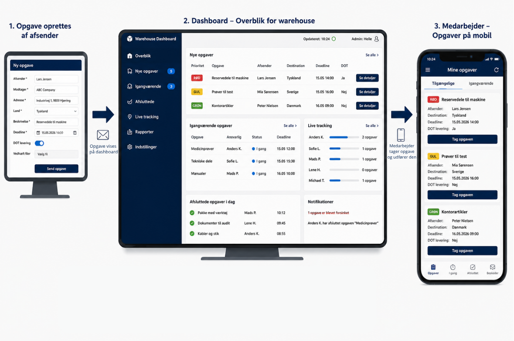
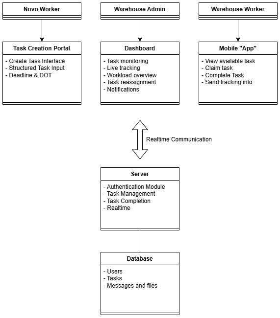

# M6-Eksamen
M6: Design af it-baserede systemer

## Beskrivelse af projekt valg
Projektet er taget fra semesterprojektet, hvor der samarbejdes med Novo Nordisk og deres warehouse (WH) afdeling. Der skal desgines og udvikles en digital løsning til at optimere deres opgavefordeling og synlighed af opgaver de får derude. Det omhandler når der skal sendes pakker ud af huset, hvor der før hen blev sendt en mail, opgaven fordeles manuelt og der kommunikeres at opgaven er fuldført via mail igen.

Der opstår typiske problemer ved at der opstår dobbeltarbejde ved dårlig kommunikation, tavs viden ift. hvem der kan specifikke opgaver og har taget en opgave, samt generelt uoverskuelig hvad der foregår derude ved disse opgaver. 

### Ideen til løsningen

Vi kalder det for en McDonaldsfisering, hvor warehouse medarbejderne skal have et dashboard ude ved dem som ville være deres nye opgavefordeler. Her ændrer vi så triggering event fra at være en mail til at være en opgave der bliver sendt ind til dashboardet. Her vil der så være nogle felter afsenderen SKAL udfylde således alt korrekt information bliver givet videre og fjerner WH medarbejdernes behov for at følge op i visse tilfælde.

Den opgave der bliver sendt ind skal så have en deadline og evt. et flag omkring DOT levering. Kunne visualiseres med grøn, gul og rød alt efter hvor meget den haster / hvor meget tid der er inden deadline. 

WH medarbejderne skal så kunne tage disse opgaver fra deres client side, som kunne forgå på mobilen. Her skal der så kun være mulighed for at tage opgaven, udføre resten af processen som den står og efterfølgende marker den som færdiggjort med mulighed for at sende en besked til afsender som f.eks. trackingnummer, fragtbrev og toldfaktura. 

På dashboardet kunne der også være en sektion med "live-tracking" af igangværende opgaver på de enkelte medarbejdere der er mødt ind så der kan hjælpes til eller lave realtids opfølgning på opgaven. Dette ville også give mulighed for at se om en syg eller fraværende medarbejder har en opgave der ikke er blevet gennemført endnu og skal følges op på af en anden. 

For at flytte en opgave tænker jeg at senior WH medarbejderen, Helle, skal have mulighed for at logge ind som admin og flytte opgaver hvis der er behov for dette.

## Udviklingsfordeling og "sprints" timeline
Deles op med frontend og backend arbejde på forskellige branches efter aftalt fælles design.

Projektet udvikles gennem en iterativ udviklingsproces opdelt i mindre udviklingsfaser ("sprints"), hvor der løbende udvikles og derefter testes fælles ved at merges til main sidst på dagen.

Udviklingen opdeles i følgende overordnede sprints:

### Sprint "0" – Problemforståelse og design fra projektarbejde
- Analyse af warehouse workflow
- Identifikation af kritiske problemer i AS-IS workflowet
- Udarbejdelse af TO-BE redesign
- Mockup og visualisering af løsning

### Sprint 1 – Projekt setup og fælles struktur
25/05
- Projekt setup
- Installation og konfiguration af Node.js
- Oprettelse af frontend og backend branches
- Filstruktur
- Opdatering af README
- Opsætning af GitHub Projects / Kanban board???
- Fælles valg af tech-stack og udviklingsroller

### Sprint 2 – Server setup og dashboard start
26/05\
Backend:
- Opsætning af localhost Express server
- Routing til views og API endpoints
- Grundlæggende serverstruktur

Frontend:
- Start på dashboard layout
- Opsætning af HTML/CSS struktur
- Første dashboard komponenter baseret på mockup

### Sprint 3 – Database og medarbejder terminaler
27/05\
Backend:
- SQLite database setup
- Database initialization og schemas
- Task creation endpoints
- Rollebaseret authentication

Frontend:
- Start på mobile worker interface
- Start på task creation portal
- UI komponenter til opgavevisning

### Sprint 4 – Integration og realtids-funktionalitet
28/05 \
Backend:
- Realtime opdateringer via Socket.IO
- Funktionelle API routes
- Test med Thunder Client

Frontend:
- Realtids opdatering mellem dashboard og mobile views
- Claim/complete task workflows
- Polering af dashboard og mobile layouts
- UI til live tracking og workload overview

### Sprint 5 – Fælles polering og aflevering
29-31/05????
- Bug fixing??
- Simpel login side
- Middleware til authentication af sessioner
- Klargør README til aflevering
- Polering så det stemmer med Mockup
    - Test af samlet workflow
- AFLEVER!


# Design og arkitektur
Selve designet / visionen for systemet er således:


Systemet bliver en serverbaseret webapplikation bestående af 4 primære klientgrænseflader:
- Login interface
- Task Creation Portal (1)
- Warehouse Dashboard (2)
- Mobile Worker Interface (3)

Hertil en database der skal lagre:
- Users
- Opgaver / tasks
- Task historik
- Beskeder der "sendes" ved afslutning af task

## Requirements
Krav som fundet i forlængelse af AS-IS og TO-BE analyse i projektarbejdet

### Novo Worker / "kunden"
- Skal kunne oprette nye warehouse opgaver
- Skal kunne angive deadline
- Skal kunne markere DOT levering
- Skal kunne videregive relevant information

### Warehouse Worker
- Skal kunne se tilgængelige opgaver
- Skal kunne tage opgaver
- Skal kunne afslutte opgaver
- Skal kunne sende tracking information ved afslutning

### Warehouse Admin & Dashboard info
- Skal kunne overvåge alle opgaver
- Skal kunne se workload overview
- Skal kunne reassigne opgaver
- Skal kunne følge live status på warehouse aktiviteter

## Teknologier
Valg af teknologier:

### Frontend
- HTML
- CSS
- JavaScript

### Backend
- Node.js
- Express.js
- Socket.IO

### Database
- SQLite

### Versionsstyring og samarbejde
- GitHub Desktop
- GitHub
- Liveshare

## Struktur og sammenhæng
Her ses hvordan vi er gået fra et mockup til egentlig systemdesign på baggrund af de valgte teknologier



Fælles aftale for filstruktur, så der kan udvikles parallelt!!! (Temp filer for nu)

```bash
M6-Eksamen/
│
├── public/
│   ├── css/
│   └── js/
│
├── server/
│   ├── database/
│   ├── middleware/
│   └── routes/
│
├── views/
│   ├── admin.html
│   ├── login.html
│   ├── mobile.html
│   └── task.html
└──
```

# Vigtige kommandoer / setup
For at initialisere Node til projektet og installere alle dependencies skal disse kommandoer køres:

npm init -y \
npm install express sqlite3 express-session bcrypt socket.io (Tech-stack som vi regner med at bruge) \
npm install nodemon --save-dev (Rart at have til at genstarte applikationer når der foretages en ændring)